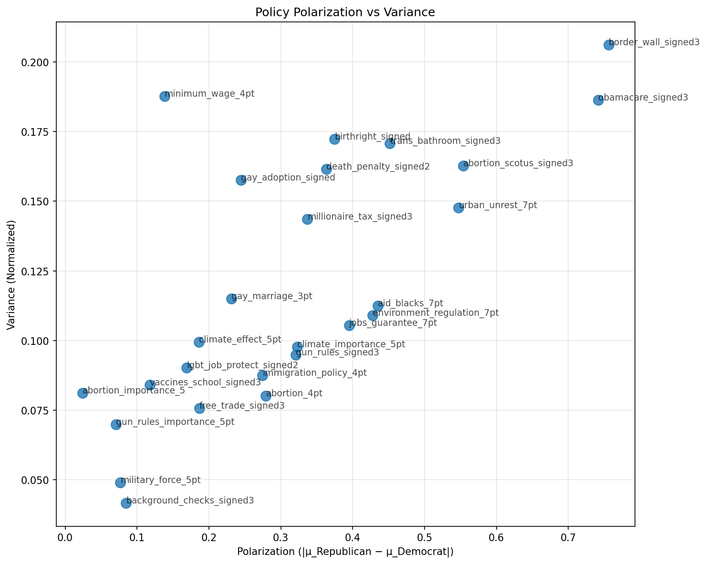

# ANES 2020 Policy Polarization Analysis

This project analyzes policy preferences and partisan polarization using data from the American National Election Studies (ANES) 2020 Time Series Study.

## Overview

The analysis examines how different policy issues vary in public opinion and how polarized they are between Democrats and Republicans. By calculating both variance (overall disagreement) and polarization (partisan disagreement), we can identify which issues divide Americans most deeply.

## Data Source

- **Dataset**: ANES 2020 Time Series Study
- **Raw Data**: `data/anes_timeseries_2020_csv_20220210.csv`
- **Codebook**: `data/anes_timeseries_2020_userguidecodebook_20220210.txt`

## Policy Column Selection and Transformation

### Selection Criteria

Policy variables were selected based on the following criteria:
1. **Closed-ended questions** with defined response scales (excludes open-ended and restricted access variables)
2. **Substantive policy content** covering major political issues
3. **Non-demographic** variables (ideology and party ID are tracked separately)

### Transformation Methodology

All policy variables were transformed to a consistent directional scale where possible:

1. **Simple Directional Mapping**: Variables with clear liberal/conservative direction were mapped to signed scales (e.g., -1 for conservative, +1 for liberal)

2. **Direction × Strength Variables**: Questions that captured both position and intensity were combined into signed strength scales:
   - Direction codes (favor/oppose) mapped to signs (-1, 0, +1)
   - Strength codes (strongly/moderately/a little) mapped to magnitudes (3, 2, 1)
   - Final score = Direction × Strength (range: -3 to +3)

3. **Ordinal Scales**: Multi-point scales (4pt, 5pt, 7pt) were preserved in their original ordinal structure

4. **Missing Data Handling**: Standard ANES missing codes (-9 to -1, 99) were converted to NaN

### Policy Categories Included

- **Social Issues**: Abortion, LGBTQ rights, gay marriage, transgender bathroom policy
- **Immigration**: Border wall, birthright citizenship, general immigration policy
- **Environment**: Climate change beliefs, environmental regulation
- **Guns**: Background checks, gun regulations
- **Health Care**: Obamacare approval, vaccine requirements, millionaire tax
- **Economic**: Jobs guarantee, aid to Black Americans, minimum wage, urban unrest
- **Criminal Justice**: Death penalty
- **Trade & Defense**: Free trade attitudes, military force

### Normalization

For cross-policy comparison, all policy columns were min-max normalized to [0, 1]:

```
normalized_value = (value - min) / (max - min)
```

**Note**: Ideology and party ID variables were excluded from normalization to serve as independent grouping variables.

## Analysis Results

### 1. Policy Variance

Variance measures overall disagreement on each issue across all respondents, indicating which policies lack consensus.

**High variance policies** show Americans are divided across the political spectrum on these issues, with opinions distributed widely rather than clustered around a single position.

### 2. Policy Polarization by Party

Polarization is calculated as the absolute difference between Republican and Democratic mean positions:

```
Polarization = |μ_Republican - μ_Democrat|
```

**Top 10 Most Polarized Policies:**
1. Border wall
2. Abortion-related issues
3. Gun regulations
4. Climate/environment
5. Obamacare approval
6. Immigration policy
7. LGBTQ rights
8. Economic redistribution

### 3. Polarization vs. Variance



The scatter plot reveals the relationship between overall disagreement (variance) and partisan disagreement (polarization):

- **High variance + high polarization**: Issues where both parties have diverse opinions AND strong partisan differences
- **Low variance + high polarization**: Issues where parties have distinct but internally unified positions
- **High variance + low polarization**: Issues with diverse opinions that don't align with party lines

## Files

- `main.ipynb` - Main analysis notebook
- `data/policy_clean.csv` - Cleaned and transformed policy dataset
- `data/extracted_questions.txt` - Extracted questions from ANES codebook
- `policy_questions.md` - List of policy questions analyzed
- `ideology_partisan_questions.md` - Ideology and partisan identity questions

## Requirements

```
pandas
numpy
matplotlib
pymupdf
tiktoken
```

## Usage

Run the cells in `main.ipynb` sequentially to:
1. Extract questions from the ANES codebook
2. Clean and transform policy variables
3. Calculate variance and polarization metrics
4. Generate visualizations

## Notes

- All analysis excludes respondents with missing data on specific variables
- Party ID is coded as: -1 (Democrat), 0 (Independent), +1 (Republican)
- The analysis focuses on policy preferences, not voting behavior or candidate evaluations
